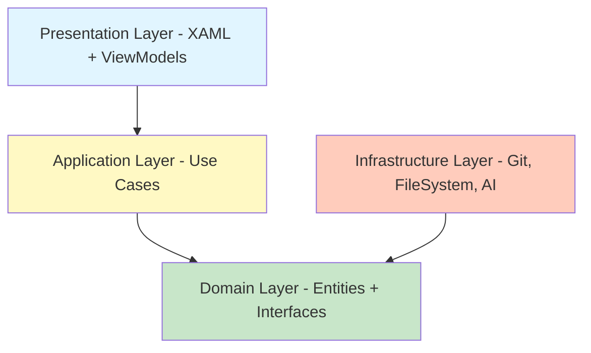

# 🏗️ Propuesta de Reorganización Arquitectónica - Chapi Assistant

## 📊 Diagnóstico Actual

### Problemas Identificados

> [!WARNING]
> **MainWindow.xaml.cs tiene 3,637 líneas** - Esto viola el Principio de Responsabilidad Única (SRP)

#### 1. **God Object Anti-Pattern** 
`MainWindow.xaml.cs` concentra demasiadas responsabilidades:
- Gestión de UI y eventos
- Lógica de negocio de Git
- Manejo de proyectos
- Gestión de cambios y commits
- Historial y tags
- Stashes
- Diff viewer
- Actualizaciones
- File system watching
- Notificaciones
- Diálogos

#### 2. **Acoplamiento Alto**
- La ventana principal conoce y maneja directamente todas las operaciones
- Difícil testear componentes individuales
- Cambios en una funcionalidad pueden afectar otras

#### 3. **Duplicación de Código**
- Lógica repetida en diferentes vistas
- Helpers con responsabilidades mezcladas
- Servicios incompletos

#### 4. **Falta de Abstracción**
- Llamadas directas a `Git.EjecutarGit()` por todos lados
- No hay interfaces para servicios
- Difícil mockear para testing

---

## 🎯 Arquitectura Propuesta: Clean Architecture + MVVM

### Estructura de Capas



### Nueva Estructura de Carpetas

```
Chapi/
├── 📁 Presentation/              # Capa de Presentación
│   ├── ViewModels/
│   │   ├── MainViewModel.cs
│   │   ├── ChangesViewModel.cs
│   │   ├── HistoryViewModel.cs
│   │   ├── TagsViewModel.cs
│   │   ├── StashViewModel.cs
│   │   ├── ProjectViewModel.cs
│   │   └── Base/
│   │       ├── ViewModelBase.cs
│   │       └── RelayCommand.cs
│   ├── Views/
│   │   ├── MainWindow.xaml[.cs]
│   │   ├── Changes/
│   │   ├── History/
│   │   ├── Tags/
│   │   └── Dialogs/
│   ├── Converters/
│   └── Behaviors/
│
├── 📁 Application/               # Capa de Aplicación (Use Cases)
│   ├── UseCases/
│   │   ├── Git/
│   │   │   ├── CommitChangesUseCase.cs
│   │   │   ├── PushChangesUseCase.cs
│   │   │   ├── PullChangesUseCase.cs
│   │   │   ├── FetchChangesUseCase.cs
│   │   │   ├── CreateTagUseCase.cs
│   │   │   ├── SwitchBranchUseCase.cs
│   │   │   └── StashChangesUseCase.cs
│   │   ├── Project/
│   │   │   ├── CreateProjectUseCase.cs
│   │   │   ├── LoadProjectUseCase.cs
│   │   │   └── CloneProjectUseCase.cs
│   │   └── AI/
│   │       ├── GenerateCommitMessageUseCase.cs
│   │       └── GenerateModuleUseCase.cs
│   ├── DTOs/
│   │   ├── GitStatusDto.cs
│   │   ├── CommitDto.cs
│   │   └── ProjectDto.cs
│   └── Interfaces/
│       └── IUseCase.cs
│
├── 📁 Domain/                    # Capa de Dominio
│   ├── Entities/
│   │   ├── GitCommit.cs
│   │   ├── GitBranch.cs
│   │   ├── GitTag.cs
│   │   ├── GitStash.cs
│   │   ├── FileChange.cs
│   │   └── Project.cs
│   ├── Interfaces/
│   │   ├── Repositories/
│   │   │   ├── IGitRepository.cs
│   │   │   ├── IProjectRepository.cs
│   │   │   └── IFileSystemRepository.cs
│   │   └── Services/
│   │       ├── IAIService.cs
│   │       ├── IDialogService.cs
│   │       ├── INotificationService.cs
│   │       └── IUpdateService.cs
│   ├── ValueObjects/
│   │   ├── CommitHash.cs
│   │   ├── BranchName.cs
│   │   └── FilePath.cs
│   └── Exceptions/
│       ├── GitException.cs
│       └── ProjectException.cs
│
├── 📁 Infrastructure/            # Capa de Infraestructura
│   ├── Git/
│   │   ├── GitRepository.cs      # Implementa IGitRepository
│   │   ├── GitCommandExecutor.cs
│   │   └── GitParser.cs
│   ├── FileSystem/
│   │   ├── FileSystemRepository.cs
│   │   └── FileWatcherService.cs
│   ├── AI/
│   │   ├── GeminiAIService.cs
│   │   └── PromptBuilder.cs
│   ├── Persistence/
│   │   ├── ProjectRepository.cs
│   │   └── UserSettingsRepository.cs
│   └── External/
│       ├── UpdateService.cs
│       └── TrayIconService.cs
│
└── 📁 CrossCutting/              # Servicios Transversales
    ├── Logging/
    │   └── Logger.cs
    ├── DependencyInjection/
    │   └── ServiceConfigurator.cs
    └── Extensions/
        └── StringExtensions.cs
```

---

## 🔧 Aplicación de Principios SOLID

### 1. **S - Single Responsibility Principle (SRP)**

#### ❌ Antes
```csharp
// MainWindow.xaml.cs - 3,637 líneas haciendo TODO
public partial class MainWindow : Window
{
    private async void btnCommit_Click(object sender, RoutedEventArgs e)
    {
        // Validación
        // Lógica de Git
        // Actualización de UI
        // Manejo de errores
    }
}
```

#### ✅ Después
```csharp
// MainWindow.xaml.cs - Solo maneja la vista
public partial class MainWindow : Window
{
    public MainWindow(MainViewModel viewModel)
    {
        InitializeComponent();
        DataContext = viewModel;
    }
}

// MainViewModel.cs - Coordina la lógica de presentación
public class MainViewModel : ViewModelBase
{
    private readonly CommitChangesUseCase _commitUseCase;
    
    public ICommand CommitCommand { get; }
    
    private async Task CommitAsync()
    {
        await _commitUseCase.ExecuteAsync(new CommitRequest
        {
            Message = CommitMessage,
            Files = SelectedFiles
        });
    }
}

// CommitChangesUseCase.cs - Lógica de negocio específica
public class CommitChangesUseCase : IUseCase<CommitRequest, CommitResult>
{
    private readonly IGitRepository _gitRepo;
    private readonly INotificationService _notifications;
    
    public async Task<CommitResult> ExecuteAsync(CommitRequest request)
    {
        // Solo lógica de commit
    }
}
```

---

### 2. **O - Open/Closed Principle (OCP)**

#### ✅ Extensible sin modificar
```csharp
// Base para operaciones Git
public interface IGitOperation
{
    Task<OperationResult> ExecuteAsync(string projectPath);
}

// Implementaciones específicas
public class FetchOperation : IGitOperation { }
public class PullOperation : IGitOperation { }
public class PushOperation : IGitOperation { }

// Ejecutor genérico
public class GitOperationExecutor
{
    public async Task<OperationResult> Execute(IGitOperation operation, string path)
    {
        // Lógica común (loading, error handling)
        return await operation.ExecuteAsync(path);
    }
}
```

---

### 3. **L - Liskov Substitution Principle (LSP)**

#### ✅ Abstracciones correctas
```csharp
// Interfaz base
public interface IRepository<T>
{
    Task<T> GetByIdAsync(string id);
    Task<IEnumerable<T>> GetAllAsync();
}

// Implementaciones intercambiables
public class GitRepository : IRepository<GitCommit> { }
public class ProjectRepository : IRepository<Project> { }
```

---

### 4. **I - Interface Segregation Principle (ISP)**

#### ❌ Antes - Interfaz gorda
```csharp
public interface IGitService
{
    Task Commit();
    Task Push();
    Task Pull();
    Task Fetch();
    Task CreateTag();
    Task DeleteTag();
    Task Stash();
    Task StashPop();
    // ... 20 métodos más
}
```

#### ✅ Después - Interfaces segregadas
```csharp
public interface IGitCommitService
{
    Task<CommitResult> CommitAsync(CommitRequest request);
}

public interface IGitRemoteService
{
    Task<PushResult> PushAsync(string branch);
    Task<PullResult> PullAsync(string branch);
    Task<FetchResult> FetchAsync();
}

public interface IGitTagService
{
    Task<TagResult> CreateTagAsync(string name, string message);
    Task DeleteTagAsync(string name);
}
```

---

### 5. **D - Dependency Inversion Principle (DIP)**

#### ❌ Antes - Dependencia directa
```csharp
public class MainWindow
{
    private void LoadChanges()
    {
        var output = Git.EjecutarGit("status", projectPath); // Acoplamiento directo
    }
}
```

#### ✅ Después - Inversión de dependencias
```csharp
// Domain - Define la abstracción
public interface IGitRepository
{
    Task<IEnumerable<FileChange>> GetChangesAsync(string projectPath);
}

// Infrastructure - Implementa
public class GitRepository : IGitRepository
{
    private readonly GitCommandExecutor _executor;
    
    public async Task<IEnumerable<FileChange>> GetChangesAsync(string projectPath)
    {
        var output = await _executor.ExecuteAsync("status", projectPath);
        return GitParser.ParseStatus(output);
    }
}

// Presentation - Usa la abstracción
public class ChangesViewModel
{
    private readonly IGitRepository _gitRepo;
    
    public ChangesViewModel(IGitRepository gitRepo) // Inyección
    {
        _gitRepo = gitRepo;
    }
}
```

---

## 📋 Plan de Refactorización por Fases

### **Fase 1: Fundamentos (Semana 1-2)** 🟢

> [!IMPORTANT]
> Esta fase establece las bases sin romper funcionalidad existente

#### Tareas:
1. **Crear estructura de carpetas**
   - Crear carpetas `Domain/`, `Application/`, `Infrastructure/`, `Presentation/`
   
2. **Definir interfaces del dominio**
   - `IGitRepository`
   - `IProjectRepository`
   - `IDialogService`
   - `INotificationService`

3. **Crear entidades del dominio**
   - `GitCommit`, `GitBranch`, `GitTag`, `FileChange`, `Project`

4. **Configurar Dependency Injection**
   - Actualizar `DependencyInjectorHelper.cs`
   - Registrar servicios en `App.xaml.cs`

#### Archivos a crear:
```
Domain/
├── Entities/
│   ├── GitCommit.cs
│   ├── FileChange.cs
│   └── Project.cs
└── Interfaces/
    ├── IGitRepository.cs
    └── IProjectRepository.cs
```

---

### **Fase 2: Infraestructura (Semana 3-4)** 🟡

#### Tareas:
1. **Refactorizar Helper/GitHelper/Git.cs**
   - Extraer a `GitRepository.cs` implementando `IGitRepository`
   - Crear `GitCommandExecutor.cs` para ejecutar comandos
   - Crear `GitParser.cs` para parsear salidas

2. **Mover servicios existentes**
   - `DialogService` → `Infrastructure/Services/`
   - `NotificationService` → `Infrastructure/Services/`
   - `NetworkWatcherService` → `Infrastructure/Services/`

3. **Crear FileSystemRepository**
   - Encapsular lógica de `FileSystemWatcher`

#### Archivos a refactorizar:
```diff
- Helper/GitHelper/Git.cs (1 archivo gigante)
+ Infrastructure/Git/
  ├── GitRepository.cs
  ├── GitCommandExecutor.cs
  └── GitParser.cs
```

---

### **Fase 3: Use Cases (Semana 5-6)** 🟠

#### Tareas:
1. **Extraer lógica de MainWindow a Use Cases**
   - `CommitChangesUseCase`
   - `PushChangesUseCase`
   - `LoadHistoryUseCase`
   - `CreateTagUseCase`
   - `SwitchBranchUseCase`

2. **Cada Use Case debe:**
   - Tener una sola responsabilidad
   - Ser testeable
   - Usar inyección de dependencias

#### Ejemplo de Use Case:
```csharp
public class CommitChangesUseCase
{
    private readonly IGitRepository _gitRepo;
    private readonly INotificationService _notifications;
    private readonly IDialogService _dialogs;

    public async Task<Result> ExecuteAsync(CommitRequest request)
    {
        // 1. Validar
        if (string.IsNullOrWhiteSpace(request.Message))
            return Result.Fail("Mensaje vacío");

        // 2. Ejecutar commit
        var result = await _gitRepo.CommitAsync(
            request.ProjectPath, 
            request.Message, 
            request.Files
        );

        // 3. Notificar
        if (result.IsSuccess)
            _notifications.Show("✅ Commit exitoso");
        else
            await _dialogs.ShowError(result.Error);

        return result;
    }
}
```

---

### **Fase 4: ViewModels (Semana 7-8)** 🔵

#### Tareas:
1. **Crear ViewModels separados**
   - `MainViewModel` (coordinador principal)
   - `ChangesViewModel` (pestaña Cambios)
   - `HistoryViewModel` (pestaña Historial)
   - `TagsViewModel` (pestaña Tags)
   - `StashViewModel` (manejo de stashes)

2. **Implementar patrón MVVM completo**
   - `ICommand` para acciones
   - `INotifyPropertyChanged` para bindings
   - Separar lógica de UI

3. **Reducir MainWindow.xaml.cs**
   - De 3,637 líneas a ~200 líneas
   - Solo inicialización y eventos de ventana

#### Estructura ViewModel:
```csharp
public class ChangesViewModel : ViewModelBase
{
    private readonly LoadChangesUseCase _loadChanges;
    private readonly CommitChangesUseCase _commitChanges;
    
    public ObservableCollection<FileChangeViewModel> Changes { get; }
    public ICommand CommitCommand { get; }
    public ICommand RefreshCommand { get; }
    
    private async Task LoadAsync()
    {
        var changes = await _loadChanges.ExecuteAsync(CurrentProject);
        Changes.Clear();
        foreach (var change in changes)
            Changes.Add(new FileChangeViewModel(change));
    }
}
```

---

### **Fase 5: Testing & Optimización (Semana 9-10)** 🟣

#### Tareas:
1. **Crear proyecto de tests**
   - `Chapi.Tests`
   - Usar xUnit + Moq

2. **Tests unitarios para:**
   - Use Cases
   - ViewModels
   - Parsers
   - Validaciones

3. **Optimizaciones**
   - Lazy loading
   - Caching
   - Async/await optimizado

#### Ejemplo de Test:
```csharp
public class CommitChangesUseCaseTests
{
    [Fact]
    public async Task ExecuteAsync_WithValidMessage_ShouldCommit()
    {
        // Arrange
        var mockRepo = new Mock<IGitRepository>();
        var useCase = new CommitChangesUseCase(mockRepo.Object);
        
        // Act
        var result = await useCase.ExecuteAsync(new CommitRequest
        {
            Message = "Test commit",
            Files = new[] { "file.cs" }
        });
        
        // Assert
        Assert.True(result.IsSuccess);
        mockRepo.Verify(r => r.CommitAsync(It.IsAny<string>(), 
            "Test commit", It.IsAny<string[]>()), Times.Once);
    }
}
```

---

## 📊 Comparación Antes/Después

| Aspecto | ❌ Antes | ✅ Después |
|---------|---------|-----------|
| **MainWindow.xaml.cs** | 3,637 líneas | ~200 líneas |
| **Responsabilidades** | Todo en un lugar | Separadas por capas |
| **Testeable** | Difícil | Fácil (mocks) |
| **Mantenibilidad** | Baja | Alta |
| **Acoplamiento** | Alto | Bajo |
| **Reutilización** | Difícil | Fácil |
| **Nuevas features** | Riesgoso | Seguro |

---

## 🎁 Beneficios Esperados

### 1. **Mantenibilidad** 📈
- Código organizado por responsabilidades
- Fácil encontrar y modificar funcionalidad
- Menos bugs por cambios

### 2. **Escalabilidad** 🚀
- Agregar nuevas funcionalidades sin tocar código existente
- Múltiples desarrolladores pueden trabajar en paralelo
- Fácil integrar nuevos servicios (GitLab, Azure DevOps, etc.)

### 3. **Testabilidad** ✅
- Tests unitarios para cada componente
- Mocks para dependencias externas
- Mayor confianza en refactorizaciones

### 4. **Rendimiento** ⚡
- Lazy loading de componentes
- Mejor gestión de memoria
- Operaciones asíncronas optimizadas

### 5. **Colaboración** 👥
- Código más legible
- Convenciones claras
- Documentación implícita en la estructura

---

## 🚦 Próximos Pasos

1. **Revisar esta propuesta** y ajustar según tus prioridades
2. **Decidir si empezar por fases** o hacer un "big bang"
3. **Crear branch de refactorización** para no afectar desarrollo actual
4. **Comenzar con Fase 1** (fundamentos)

---

## 💡 Recomendaciones Adicionales

> [!TIP]
> **Estrategia de Migración Gradual**
> - No intentes refactorizar todo de golpe
> - Usa el patrón "Strangler Fig": reemplaza gradualmente el código viejo
> - Mantén ambas versiones funcionando durante la transición

> [!CAUTION]
> **Riesgos a Considerar**
> - Tiempo de desarrollo inicial más largo
> - Curva de aprendizaje para nuevos patrones
> - Posibles bugs durante la transición

### Herramientas Recomendadas
- **ReSharper** o **Rider**: Refactorización automática
- **SonarLint**: Análisis de código
- **xUnit + Moq**: Testing
- **BenchmarkDotNet**: Medición de rendimiento

---

## 📚 Recursos de Aprendizaje

- [Clean Architecture - Robert C. Martin](https://blog.cleancoder.com/uncle-bob/2012/08/13/the-clean-architecture.html)
- [MVVM Pattern - Microsoft Docs](https://docs.microsoft.com/en-us/xamarin/xamarin-forms/enterprise-application-patterns/mvvm)
- [SOLID Principles - C#](https://www.c-sharpcorner.com/UploadFile/damubetha/solid-principles-in-C-Sharp/)

---

**¿Listo para empezar? 🚀**
