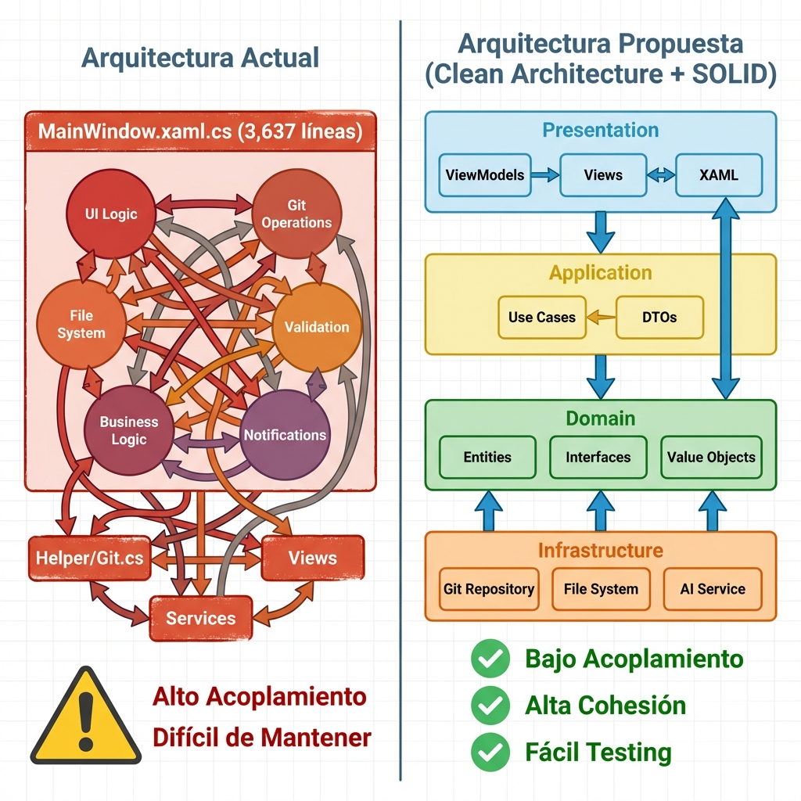

# 🗺️ Roadmap Ejecutable - Refactorización Chapi Assistant



---

## 📅 Cronograma General

| Fase | Duración | Esfuerzo | Prioridad |
|------|----------|----------|-----------|
| **Fase 0: Preparación** | 1-2 días | Bajo | 🔴 Crítica |
| **Fase 1: Fundamentos** | 3-5 días | Medio | 🔴 Crítica |
| **Fase 2: Infraestructura** | 5-7 días | Alto | 🟠 Alta |
| **Fase 3: Use Cases** | 7-10 días | Alto | 🟠 Alta |
| **Fase 4: ViewModels** | 5-7 días | Medio | 🟡 Media |
| **Fase 5: Testing** | 3-5 días | Medio | 🟢 Baja |

**Total estimado: 24-36 días** (4-6 semanas trabajando medio tiempo)

---

## 🚀 Fase 0: Preparación (1-2 días)

### Objetivos
- Crear entorno seguro para refactorizar
- Documentar estado actual
- Configurar herramientas

### Tareas

#### 1. Crear Branch de Refactorización
```bash
# Asegúrate de estar en la rama principal
git checkout main
git pull origin main

# Crear branch para refactorización
git checkout -b refactor/clean-architecture

# Push inicial
git push -u origin refactor/clean-architecture
```

#### 2. Documentar Estado Actual
- [ ] Tomar screenshots de la aplicación funcionando
- [ ] Documentar todas las funcionalidades actuales
- [ ] Crear lista de casos de uso principales
- [ ] Identificar dependencias externas

#### 3. Configurar Herramientas
```bash
# Instalar paquetes necesarios para DI
dotnet add package Microsoft.Extensions.DependencyInjection
dotnet add package Microsoft.Extensions.Logging

# Para testing (opcional en esta fase)
dotnet new xunit -n Chapi.Tests
dotnet sln add Chapi.Tests/Chapi.Tests.csproj
```

#### 4. Crear Estructura de Carpetas Base
```bash
cd Chapi

# Crear estructura de carpetas
mkdir Domain
mkdir Domain\Entities
mkdir Domain\Interfaces
mkdir Domain\ValueObjects
mkdir Domain\Exceptions

mkdir Application
mkdir Application\UseCases
mkdir Application\DTOs
mkdir Application\Interfaces

mkdir Infrastructure
mkdir Infrastructure\Git
mkdir Infrastructure\FileSystem
mkdir Infrastructure\Persistence
mkdir Infrastructure\External

mkdir Presentation
mkdir Presentation\ViewModels
mkdir Presentation\ViewModels\Base
```

#### ✅ Checklist de Validación
- [ ] Branch creado y pusheado
- [ ] Estructura de carpetas creada
- [ ] Paquetes NuGet instalados
- [ ] Aplicación actual sigue compilando
- [ ] Documentación de estado actual completa

---

## 🏗️ Fase 1: Fundamentos (3-5 días)

### Objetivos
- Definir contratos (interfaces)
- Crear entidades del dominio
- Configurar Dependency Injection

### Día 1-2: Entidades del Dominio

#### Crear Entidades Base

**Domain/Entities/GitCommit.cs**
```csharp
namespace Chapi.Domain.Entities;

public class GitCommit
{
    public string Hash { get; set; }
    public string ShortHash => Hash?.Substring(0, 7) ?? string.Empty;
    public string Author { get; set; }
    public string Message { get; set; }
    public string Description { get; set; }
    public DateTime Date { get; set; }
    public string RelativeDate { get; set; }
    public bool IsUnpushed { get; set; }
    public List<string> Tags { get; set; } = new();
}
```

**Domain/Entities/FileChange.cs**
```csharp
namespace Chapi.Domain.Entities;

public class FileChange
{
    public string FilePath { get; set; }
    public ChangeStatus Status { get; set; }
    public int Additions { get; set; }
    public int Deletions { get; set; }
    
    public string FileName => Path.GetFileName(FilePath);
    public bool IsValid() => !string.IsNullOrWhiteSpace(FilePath);
}

public enum ChangeStatus
{
    Modified,
    Added,
    Deleted,
    Renamed,
    Untracked,
    Conflict
}
```

**Domain/Entities/Project.cs**
```csharp
namespace Chapi.Domain.Entities;

public class Project
{
    public string FullPath { get; set; }
    public string Name { get; set; }
    public string CurrentBranch { get; set; }
    public int AheadCount { get; set; }
    public int BehindCount { get; set; }
    
    public bool IsValid() => Directory.Exists(FullPath);
}
```

**Domain/Entities/GitBranch.cs**
```csharp
namespace Chapi.Domain.Entities;

public class GitBranch
{
    public string Name { get; set; }
    public bool IsActive { get; set; }
    public bool IsRemote { get; set; }
    public string RemoteName { get; set; }
}
```

**Domain/Entities/GitTag.cs**
```csharp
namespace Chapi.Domain.Entities;

public class GitTag
{
    public string Name { get; set; }
    public string CommitHash { get; set; }
    public string Message { get; set; }
    public DateTime Date { get; set; }
}
```

**Domain/Entities/GitStash.cs**
```csharp
namespace Chapi.Domain.Entities;

public class GitStash
{
    public int Index { get; set; }
    public string Name { get; set; }
    public string Branch { get; set; }
    public string Message { get; set; }
}
```

#### Tareas
- [ ] Crear todas las entidades listadas arriba
- [ ] Compilar y verificar que no hay errores
- [ ] Commit: `git commit -m "feat: add domain entities"`

### Día 2-3: Interfaces del Dominio

**Domain/Interfaces/IGitRepository.cs**
```csharp
namespace Chapi.Domain.Interfaces;

public interface IGitRepository
{
    // Commits
    Task<Result<GitCommit>> CommitAsync(string projectPath, string message);
    Task<IEnumerable<GitCommit>> GetCommitsAsync(string projectPath, int limit);
    Task<HashSet<string>> GetUnpushedCommitsAsync(string projectPath, string branch);
    
    // Changes
    Task<IEnumerable<FileChange>> GetChangesAsync(string projectPath);
    Task<Result> StageFilesAsync(string projectPath, IEnumerable<string> files);
    Task<Result> UnstageFilesAsync(string projectPath, IEnumerable<string> files);
    
    // Branches
    Task<IEnumerable<GitBranch>> GetBranchesAsync(string projectPath);
    Task<string> GetCurrentBranchAsync(string projectPath);
    Task<Result> SwitchBranchAsync(string projectPath, string branchName);
    
    // Remote
    Task<Result> PushAsync(string projectPath, string branch);
    Task<Result> PullAsync(string projectPath, string branch);
    Task<Result> FetchAsync(string projectPath);
    
    // Tags
    Task<IEnumerable<GitTag>> GetTagsAsync(string projectPath);
    Task<Result> CreateTagAsync(string projectPath, string name, string message);
    Task<Result> DeleteTagAsync(string projectPath, string name);
    
    // Stash
    Task<IEnumerable<GitStash>> GetStashesAsync(string projectPath);
    Task<Result> StashAsync(string projectPath, string message);
    Task<Result> StashPopAsync(string projectPath, int index);
}
```

**Domain/Interfaces/IProjectRepository.cs**
```csharp
namespace Chapi.Domain.Interfaces;

public interface IProjectRepository
{
    Task<IEnumerable<Project>> GetAllProjectsAsync();
    Task<Project> GetProjectAsync(string path);
    Task AddProjectAsync(string path);
    Task RemoveProjectAsync(string path);
}
```

**Domain/Interfaces/IDialogService.cs**
```csharp
namespace Chapi.Domain.Interfaces;

public interface IDialogService
{
    Task<bool> ShowConfirmAsync(string title, string message);
    Task ShowErrorAsync(string title, string message);
    Task ShowInfoAsync(string title, string message);
    Task<(bool Success, string Value)> ShowInputAsync(string title, string prompt);
}
```

**Domain/Interfaces/INotificationService.cs**
```csharp
namespace Chapi.Domain.Interfaces;

public interface INotificationService
{
    void ShowSuccess(string message);
    void ShowError(string message);
    void ShowInfo(string message);
    void ShowWarning(string message);
}
```

**Domain/Common/Result.cs**
```csharp
namespace Chapi.Domain.Common;

public class Result
{
    public bool IsSuccess { get; protected set; }
    public string Error { get; protected set; }
    
    public static Result Success() => new() { IsSuccess = true };
    public static Result Fail(string error) => new() { IsSuccess = false, Error = error };
}

public class Result<T> : Result
{
    public T Data { get; set; }
    
    public static Result<T> Success(T data) => new() { IsSuccess = true, Data = data };
    public new static Result<T> Fail(string error) => new() { IsSuccess = false, Error = error };
}
```

#### Tareas
- [ ] Crear todas las interfaces
- [ ] Crear clase `Result` para manejo de errores
- [ ] Compilar y verificar
- [ ] Commit: `git commit -m "feat: add domain interfaces and result pattern"`

### Día 3-4: Configurar Dependency Injection

**App.xaml.cs** (refactorizar)
```csharp
using Microsoft.Extensions.DependencyInjection;
using Chapi.Infrastructure.Git;
using Chapi.Infrastructure.Persistence;
using Chapi.Application.UseCases.Git;
using Chapi.Presentation.ViewModels;

namespace Chapi;

public partial class App : Application
{
    private ServiceProvider _serviceProvider;
    public static IServiceProvider Services { get; private set; }

    protected override void OnStartup(StartupEventArgs e)
    {
        base.OnStartup(e);

        var services = new ServiceCollection();
        ConfigureServices(services);
        _serviceProvider = services.BuildServiceProvider();
        Services = _serviceProvider;

        // Por ahora, seguir usando MainWindow normal
        // En Fase 4 cambiaremos a inyección
        var mainWindow = new MainWindow();
        mainWindow.Show();
    }

    private void ConfigureServices(IServiceCollection services)
    {
        // Infrastructure
        services.AddSingleton<GitCommandExecutor>();
        services.AddSingleton<GitOutputParser>();
        services.AddScoped<IGitRepository, GitRepository>();
        services.AddScoped<IProjectRepository, ProjectRepository>();
        
        // Services (mover los existentes)
        services.AddSingleton<IDialogService, DialogService>();
        services.AddSingleton<INotificationService, NotificationService>();
        
        // Use Cases (se agregarán en Fase 3)
        // ViewModels (se agregarán en Fase 4)
    }

    protected override void OnExit(ExitEventArgs e)
    {
        _serviceProvider?.Dispose();
        base.OnExit(e);
    }
}
```

#### Tareas
- [ ] Instalar `Microsoft.Extensions.DependencyInjection`
- [ ] Refactorizar `App.xaml.cs`
- [ ] Crear `ServiceProvider` estático para acceso temporal
- [ ] Compilar y ejecutar aplicación
- [ ] Commit: `git commit -m "feat: configure dependency injection"`

#### ✅ Checklist de Validación Fase 1
- [ ] Todas las entidades creadas
- [ ] Todas las interfaces definidas
- [ ] DI configurado
- [ ] Aplicación compila sin errores
- [ ] Aplicación ejecuta normalmente (sin cambios visibles aún)

---

## 🔧 Fase 2: Infraestructura (5-7 días)

### Objetivos
- Refactorizar `Helper/GitHelper/Git.cs`
- Implementar interfaces del dominio
- Crear parsers y ejecutores

### Día 1-3: Refactorizar Git

#### 1. Crear GitCommandExecutor

**Infrastructure/Git/GitCommandExecutor.cs**
```csharp
namespace Chapi.Infrastructure.Git;

public class GitCommandExecutor
{
    public async Task<CommandResult> ExecuteAsync(string command, string workingDirectory)
    {
        try
        {
            var processInfo = new ProcessStartInfo
            {
                FileName = "git",
                Arguments = command,
                WorkingDirectory = workingDirectory,
                RedirectStandardOutput = true,
                RedirectStandardError = true,
                UseShellExecute = false,
                CreateNoWindow = true
            };

            using var process = Process.Start(processInfo);
            if (process == null)
                return CommandResult.Fail("No se pudo iniciar el proceso Git");

            var output = await process.StandardOutput.ReadToEndAsync();
            var error = await process.StandardError.ReadToEndAsync();
            
            await process.WaitForExitAsync();

            if (process.ExitCode != 0 && !string.IsNullOrWhiteSpace(error))
                return CommandResult.Fail(error);

            return CommandResult.Success(output);
        }
        catch (Exception ex)
        {
            return CommandResult.Fail($"Error ejecutando Git: {ex.Message}");
        }
    }
}

public class CommandResult
{
    public bool IsSuccess { get; set; }
    public string Output { get; set; }
    public string Error { get; set; }
    
    public static CommandResult Success(string output) => 
        new() { IsSuccess = true, Output = output };
    
    public static CommandResult Fail(string error) => 
        new() { IsSuccess = false, Error = error };
}
```

#### 2. Crear GitOutputParser

**Infrastructure/Git/GitOutputParser.cs**
```csharp
namespace Chapi.Infrastructure.Git;

public class GitOutputParser
{
    private const string FieldSeparator = "\x1f";
    private const string RecordSeparator = "\x1e";

    public IEnumerable<GitCommit> ParseLogOutput(string output)
    {
        if (string.IsNullOrWhiteSpace(output))
            return Enumerable.Empty<GitCommit>();

        var commits = new List<GitCommit>();
        var records = output.Split(new[] { RecordSeparator }, StringSplitOptions.RemoveEmptyEntries);

        foreach (var record in records)
        {
            var commit = ParseCommitRecord(record);
            if (commit != null)
                commits.Add(commit);
        }

        return commits;
    }

    private GitCommit ParseCommitRecord(string record)
    {
        var parts = record.Trim().Trim('"').Split(new[] { FieldSeparator }, StringSplitOptions.None);
        
        if (parts.Length < 4)
            return null;

        return new GitCommit
        {
            Hash = parts[0],
            Author = parts[1],
            RelativeDate = parts[2],
            Message = parts[3],
            Description = parts.Length > 4 ? parts[4].Trim() : string.Empty
        };
    }

    public IEnumerable<FileChange> ParseStatusOutput(string output)
    {
        // Copiar lógica actual de MainWindow.LoadChangesAsync
        // Ver ejemplos_refactorizacion.md
    }

    public IEnumerable<GitBranch> ParseBranchOutput(string output)
    {
        // Implementar parsing de branches
    }

    // ... más métodos de parsing
}
```

#### 3. Implementar GitRepository

**Infrastructure/Git/GitRepository.cs**
```csharp
namespace Chapi.Infrastructure.Git;

public class GitRepository : IGitRepository
{
    private readonly GitCommandExecutor _executor;
    private readonly GitOutputParser _parser;

    public GitRepository(GitCommandExecutor executor, GitOutputParser parser)
    {
        _executor = executor;
        _parser = parser;
    }

    public async Task<Result<GitCommit>> CommitAsync(string projectPath, string message)
    {
        // Ver ejemplos_refactorizacion.md para implementación completa
    }

    public async Task<IEnumerable<FileChange>> GetChangesAsync(string projectPath)
    {
        var result = await _executor.ExecuteAsync("status --porcelain -uall", projectPath);
        if (!result.IsSuccess)
            return Enumerable.Empty<FileChange>();

        return _parser.ParseStatusOutput(result.Output);
    }

    // Implementar todos los métodos de IGitRepository
    // Mover lógica desde Helper/GitHelper/Git.cs
}
```

#### Tareas
- [ ] Crear `GitCommandExecutor.cs`
- [ ] Crear `GitOutputParser.cs`
- [ ] Crear `GitRepository.cs` implementando `IGitRepository`
- [ ] Mover toda la lógica de `Helper/GitHelper/Git.cs`
- [ ] Compilar y verificar
- [ ] Commit: `git commit -m "feat: implement git infrastructure layer"`

### Día 4-5: Implementar Otros Repositorios

**Infrastructure/Persistence/ProjectRepository.cs**
```csharp
namespace Chapi.Infrastructure.Persistence;

public class ProjectRepository : IProjectRepository
{
    private readonly string _settingsPath;

    public ProjectRepository()
    {
        _settingsPath = Path.Combine(
            Environment.GetFolderPath(Environment.SpecialFolder.ApplicationData),
            "Chapi",
            "projects.json"
        );
    }

    public async Task<IEnumerable<Project>> GetAllProjectsAsync()
    {
        // Mover lógica de ProjectSettings.LoadProjects()
    }

    public async Task AddProjectAsync(string path)
    {
        // Mover lógica de ProjectSettings.AddProject()
    }

    // ... implementar resto de métodos
}
```

#### Tareas
- [ ] Implementar `ProjectRepository`
- [ ] Mover servicios existentes a `Infrastructure/Services/`
- [ ] Adaptar servicios a interfaces del dominio
- [ ] Commit: `git commit -m "feat: implement persistence layer"`

#### ✅ Checklist de Validación Fase 2
- [ ] `GitRepository` implementado completamente
- [ ] Todos los parsers funcionando
- [ ] `ProjectRepository` implementado
- [ ] Servicios migrados
- [ ] Tests manuales de operaciones Git funcionan

---

## 🎯 Fase 3: Use Cases (7-10 días)

### Objetivos
- Extraer lógica de negocio de MainWindow
- Crear Use Cases independientes y testeables

### Día 1-2: Use Cases de Commit

**Application/UseCases/Git/CommitChangesUseCase.cs**

Ver `ejemplos_refactorizacion.md` para implementación completa.

#### Tareas
- [ ] Crear `CommitChangesUseCase`
- [ ] Crear `LoadChangesUseCase`
- [ ] Crear DTOs necesarios
- [ ] Registrar en DI
- [ ] Commit: `git commit -m "feat: add commit use cases"`

### Día 3-4: Use Cases de Remote Operations

**Application/UseCases/Git/PushChangesUseCase.cs**
**Application/UseCases/Git/PullChangesUseCase.cs**
**Application/UseCases/Git/FetchChangesUseCase.cs**

#### Tareas
- [ ] Crear use cases de Push, Pull, Fetch
- [ ] Mover lógica de `DoPushAsync`, `DoPullAsync`, `DoFetchAsync`
- [ ] Registrar en DI
- [ ] Commit: `git commit -m "feat: add remote operation use cases"`

### Día 5-6: Use Cases de History y Tags

**Application/UseCases/Git/LoadHistoryUseCase.cs**
**Application/UseCases/Git/CreateTagUseCase.cs**
**Application/UseCases/Git/DeleteTagUseCase.cs**

#### Tareas
- [ ] Crear use cases de historial
- [ ] Crear use cases de tags
- [ ] Mover lógica correspondiente
- [ ] Commit: `git commit -m "feat: add history and tag use cases"`

### Día 7: Use Cases de Branches y Stash

**Application/UseCases/Git/SwitchBranchUseCase.cs**
**Application/UseCases/Git/StashChangesUseCase.cs**

#### Tareas
- [ ] Crear use cases de branches
- [ ] Crear use cases de stash
- [ ] Commit: `git commit -m "feat: add branch and stash use cases"`

#### ✅ Checklist de Validación Fase 3
- [ ] Todos los use cases creados
- [ ] Use cases registrados en DI
- [ ] Lógica de negocio extraída de MainWindow
- [ ] Compilación exitosa

---

## 🎨 Fase 4: ViewModels (5-7 días)

### Objetivos
- Implementar patrón MVVM completo
- Reducir MainWindow.xaml.cs drásticamente

### Día 1: Base Classes

**Presentation/ViewModels/Base/ViewModelBase.cs**
```csharp
namespace Chapi.Presentation.ViewModels.Base;

public abstract class ViewModelBase : INotifyPropertyChanged
{
    public event PropertyChangedEventHandler PropertyChanged;

    protected virtual void OnPropertyChanged([CallerMemberName] string propertyName = null)
    {
        PropertyChanged?.Invoke(this, new PropertyChangedEventArgs(propertyName));
    }

    protected bool SetProperty<T>(ref T field, T value, [CallerMemberName] string propertyName = null)
    {
        if (EqualityComparer<T>.Default.Equals(field, value))
            return false;

        field = value;
        OnPropertyChanged(propertyName);
        return true;
    }
}
```

**Presentation/ViewModels/Base/RelayCommand.cs**
```csharp
namespace Chapi.Presentation.ViewModels.Base;

public class RelayCommand : ICommand
{
    private readonly Func<Task> _execute;
    private readonly Func<bool> _canExecute;

    public RelayCommand(Func<Task> execute, Func<bool> canExecute = null)
    {
        _execute = execute ?? throw new ArgumentNullException(nameof(execute));
        _canExecute = canExecute;
    }

    public event EventHandler CanExecuteChanged;

    public bool CanExecute(object parameter) => _canExecute?.Invoke() ?? true;

    public async void Execute(object parameter) => await _execute();

    public void RaiseCanExecuteChanged() => CanExecuteChanged?.Invoke(this, EventArgs.Empty);
}
```

### Día 2-3: ChangesViewModel

**Presentation/ViewModels/ChangesViewModel.cs**

Ver `ejemplos_refactorizacion.md` para implementación completa.

#### Tareas
- [ ] Crear `ChangesViewModel`
- [ ] Mover lógica de pestaña Cambios
- [ ] Actualizar XAML bindings
- [ ] Probar funcionalidad
- [ ] Commit: `git commit -m "feat: add ChangesViewModel"`

### Día 4: HistoryViewModel

**Presentation/ViewModels/HistoryViewModel.cs**

#### Tareas
- [ ] Crear `HistoryViewModel`
- [ ] Mover lógica de pestaña Historial
- [ ] Actualizar bindings
- [ ] Commit: `git commit -m "feat: add HistoryViewModel"`

### Día 5: MainViewModel

**Presentation/ViewModels/MainViewModel.cs**
```csharp
namespace Chapi.Presentation.ViewModels;

public class MainViewModel : ViewModelBase
{
    public ChangesViewModel ChangesVM { get; }
    public HistoryViewModel HistoryVM { get; }
    public TagsViewModel TagsVM { get; }
    
    private Project _currentProject;
    
    public MainViewModel(
        ChangesViewModel changesVM,
        HistoryViewModel historyVM,
        TagsViewModel tagsVM)
    {
        ChangesVM = changesVM;
        HistoryVM = historyVM;
        TagsVM = tagsVM;
    }

    public Project CurrentProject
    {
        get => _currentProject;
        set
        {
            SetProperty(ref _currentProject, value);
            OnProjectChanged();
        }
    }

    private async void OnProjectChanged()
    {
        await ChangesVM.LoadAsync(CurrentProject.FullPath);
        await HistoryVM.LoadAsync(CurrentProject.FullPath);
        await TagsVM.LoadAsync(CurrentProject.FullPath);
    }
}
```

### Día 6: Refactorizar MainWindow

**MainWindow.xaml.cs** (REDUCIDO)
```csharp
namespace Chapi;

public partial class MainWindow : Window
{
    private readonly MainViewModel _viewModel;

    public MainWindow(MainViewModel viewModel)
    {
        InitializeComponent();
        _viewModel = viewModel;
        DataContext = _viewModel;
    }

    private void Window_Loaded(object sender, RoutedEventArgs e)
    {
        // Inicialización mínima
    }

    private void Window_Closing(object sender, CancelEventArgs e)
    {
        // Cleanup
    }
}
```

#### Tareas
- [ ] Crear `MainViewModel`
- [ ] Refactorizar `MainWindow.xaml.cs` (de 3,637 a ~200 líneas)
- [ ] Actualizar `App.xaml.cs` para inyectar ViewModels
- [ ] Actualizar todos los bindings en XAML
- [ ] Probar toda la aplicación
- [ ] Commit: `git commit -m "feat: complete MVVM refactoring"`

#### ✅ Checklist de Validación Fase 4
- [ ] Todos los ViewModels creados
- [ ] MainWindow reducido a <300 líneas
- [ ] Bindings funcionando correctamente
- [ ] Toda la funcionalidad preservada
- [ ] No hay regresiones

---

## ✅ Fase 5: Testing (3-5 días)

### Día 1: Setup de Testing

```bash
# Crear proyecto de tests
dotnet new xunit -n Chapi.Tests
cd Chapi.Tests

# Agregar referencias
dotnet add reference ../Chapi/Chapi.csproj
dotnet add package Moq
dotnet add package FluentAssertions

# Agregar a solución
cd ..
dotnet sln add Chapi.Tests/Chapi.Tests.csproj
```

### Día 2-3: Tests de Use Cases

Ver `ejemplos_refactorizacion.md` para ejemplos completos.

#### Tareas
- [ ] Tests para `CommitChangesUseCase`
- [ ] Tests para `LoadChangesUseCase`
- [ ] Tests para operaciones remotas
- [ ] Tests para tags y branches
- [ ] Commit: `git commit -m "test: add use case tests"`

### Día 4: Tests de ViewModels

#### Tareas
- [ ] Tests para `ChangesViewModel`
- [ ] Tests para `HistoryViewModel`
- [ ] Tests para commands
- [ ] Commit: `git commit -m "test: add viewmodel tests"`

#### ✅ Checklist de Validación Fase 5
- [ ] Cobertura de tests >70%
- [ ] Todos los tests pasan
- [ ] CI/CD configurado (opcional)

---

## 🎉 Finalización

### Checklist Final

#### Funcionalidad
- [ ] Todas las funcionalidades originales funcionan
- [ ] No hay regresiones
- [ ] Performance igual o mejor

#### Código
- [ ] MainWindow.xaml.cs <300 líneas
- [ ] Principios SOLID aplicados
- [ ] Código organizado por capas
- [ ] Sin código duplicado

#### Documentación
- [ ] README actualizado
- [ ] Diagramas de arquitectura
- [ ] Comentarios en código complejo

#### Testing
- [ ] Tests unitarios >70% cobertura
- [ ] Tests de integración básicos
- [ ] Manual de testing actualizado

### Merge a Main

```bash
# Asegúrate de que todo está commiteado
git status

# Merge a main
git checkout main
git merge refactor/clean-architecture

# Push
git push origin main

# Crear tag de versión
git tag -a v2.0.0 -m "Refactorización completa con Clean Architecture"
git push origin v2.0.0
```

---

## 📊 Métricas de Éxito

| Métrica | Antes | Después | Mejora |
|---------|-------|---------|--------|
| Líneas en MainWindow | 3,637 | <300 | 92% ↓ |
| Archivos .cs | 23 | ~80 | 248% ↑ |
| Clases con >500 líneas | 3 | 0 | 100% ↓ |
| Cobertura de tests | 0% | >70% | ∞ |
| Tiempo de compilación | X | X | = |
| Complejidad ciclomática | Alta | Baja | ↓ |

---

## 🆘 Troubleshooting

### Problema: "No compila después de refactorizar"
**Solución:** Revisa que todos los namespaces estén correctos y que las referencias entre proyectos estén bien configuradas.

### Problema: "Bindings no funcionan en XAML"
**Solución:** Verifica que el `DataContext` esté correctamente asignado y que las propiedades implementen `INotifyPropertyChanged`.

### Problema: "DI no resuelve dependencias"
**Solución:** Asegúrate de que todos los servicios estén registrados en `App.xaml.cs` con el lifetime correcto (Singleton, Scoped, Transient).

---

## 📚 Recursos Adicionales

- [Clean Architecture - Uncle Bob](https://blog.cleancoder.com/uncle-bob/2012/08/13/the-clean-architecture.html)
- [MVVM Pattern - Microsoft](https://docs.microsoft.com/en-us/xamarin/xamarin-forms/enterprise-application-patterns/mvvm)
- [Dependency Injection in .NET](https://docs.microsoft.com/en-us/dotnet/core/extensions/dependency-injection)
- [Unit Testing Best Practices](https://docs.microsoft.com/en-us/dotnet/core/testing/unit-testing-best-practices)

---

**¿Listo para empezar? 🚀 Comienza con la Fase 0 y avanza paso a paso.**
